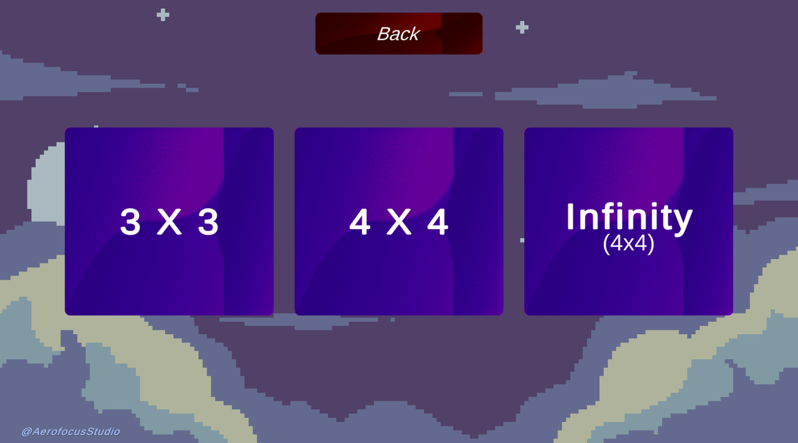
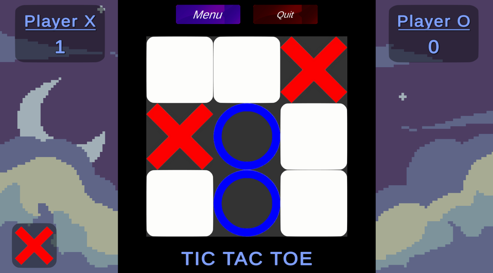
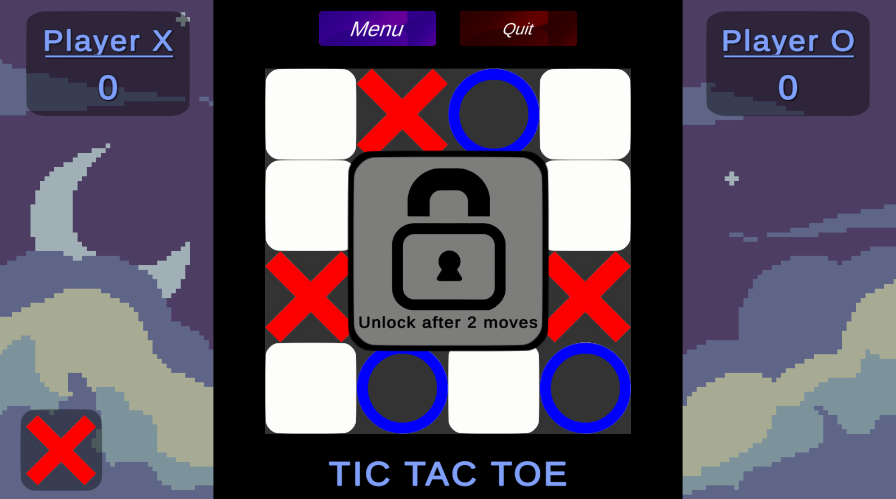
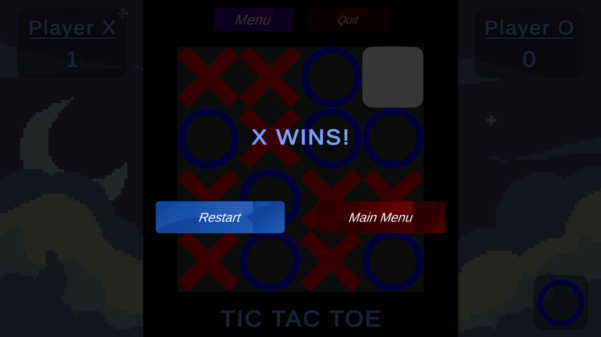

# 🎮 Tic-Tac-Toe
Itch.io linki: [Tic Tac Toe](https://aerofocus-studio.itch.io/tic-tac-toe)

A modern implementation of the classic **Tic-Tac-Toe** game developed with **Unity**. The project includes multiple board sizes, an intuitive user interface, and a clean gameplay experience.

---

## 📌 Features

* 🎲 3×3 and 4×4 game modes
* 🖥️ Simple and user-friendly interface
* 👥 Two-player local gameplay
* 🏆 Automatic winner detection
* 🤝 Draw detection
* 🔄 Restart and play again functionality
* ⚡ Smooth scene transitions

---

## 📸 Screenshots

<table align="center">
<tr>
<td align="center">
<b>Main Menu</b><br>

</td>

<td align="center">
<b>Game Mode Selection</b><br>

</td>
</tr>

<tr>
<td align="center">
<b>3×3 Board</b><br>

</td>

<td align="center">
<b>4×4 Board</b><br>

</td>
</tr>

<tr>
<td colspan="2" align="center">
<b>Game Over Screen</b><br>

</td>
</tr>
</table>

---

## 🎮 Gameplay

1. Launch the game.
2. Select your preferred board size (3×3,4×4 or infinity).
3. Players take turns placing **X** and **O**.
4. The first player to complete a valid row, column, or diagonal wins.
5. If the board fills without a winner, the match ends in a draw.

---

## 🛠️ Built With

* **Unity**
* **C#**
* **Unity Canvas System**

---

## 📂 Project Structure

```
Assets
├── Scripts
├── Screenshots
├── Sprites
└── Sounds
```

---

## 🚀 Getting Started

### Clone the repository

```bash
git clone https://github.com/m-YUSUF-d/Tic-Tac-Toe.git
```

### Open the project

1. Open **Unity Hub**
2. Click **Open Project**
3. Select the cloned repository
4. Open the main scene and press **Play**

---

## 🎯 Future Improvements

* 🤖 Single Player (AI)
* 🌐 Online Multiplayer
* 🎵 Sound Effects & Background Music
* 🎨 Additional Themes
* 📊 Match Statistics
* 💾 Save System

---

## 📄 License

This project is created for educational and portfolio purposes.

---

